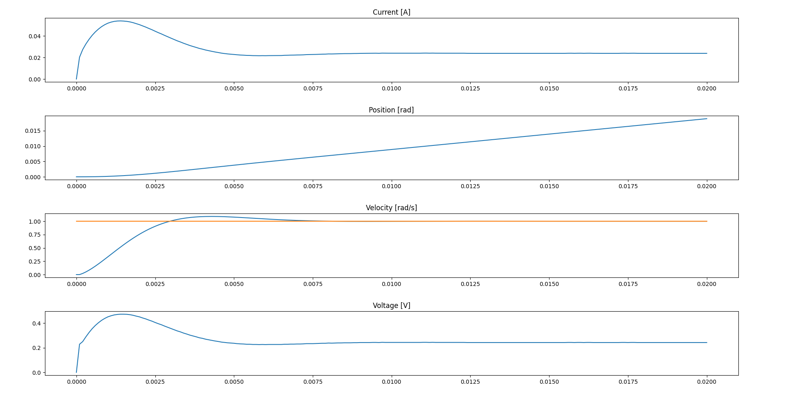

# fixed_point_pid

This repository contains an c++98 compatible implementations of a fixed point(Q format) p, pi, pd & pid controller.

Features:
* The precision of the input, output and gains can be configured at compiletime.
* Implements a simple saturation strategy to deal with windup.
* Contains a P, PI, PD and PID controller.

```c++

typedef scaled_int<6, 9>	Input_t;
typedef scaled_int<7, 8>	Output_t;

typedef scaled_int<7, 8>	Kp_t;
typedef scaled_int<2, 13>	Ki_t;

Output_t minOutput(Output_t::unscaled_float_type(-0.8));
Output_t maxOutput(Output_t::unscaled_float_type(0.8));

Kp_t kp(Kp_t::unscaled_float_type(0.075));
Ki_t ki(Ki_t::unscaled_float_type(0.002));
PIController<Input_t, Output_t, Kp_t, Ki_t> piController(kp, ki, minOutput, maxOutput);

```

The controllers are meant to run on a hard realtime system. Non uniform calls in time to the calculate output function is not supported.

## Example
An example implementation and simulation of a cascaded velocity and current controller can be found in the /examples folder. The result can be seen below:
